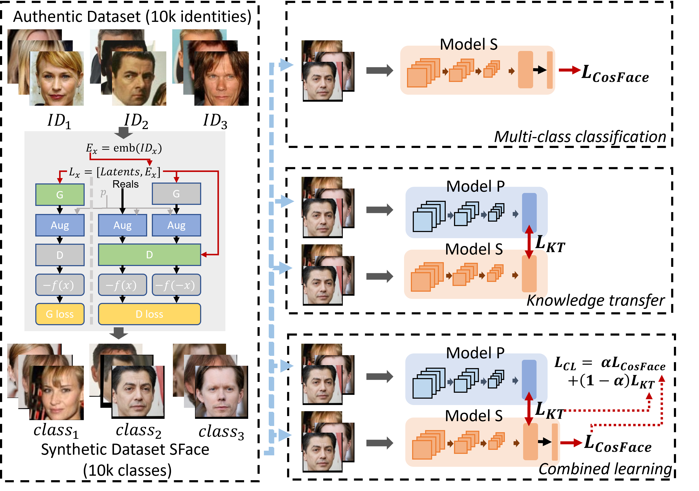

## This is the official repository of the papers:
#### SFace: Privacy-friendly and Accurate Face Recognition using Synthetic Data (IJCB 2022)
#### SFace2: Synthetic-Based Face Recognition With w-Space Identity-Driven Sampling (TBIOM 2024)
[SFace](https://arxiv.org/abs/2206.10520)

[SFace2](https://ieeexplore.ieee.org/document/10454585)



The SFace and SFace2 dataset can be downloaded from [Data](https://drive.google.com/drive/folders/1tCadaKDZdmp7K2gQ7Jy2snVdp0-PsTMH?usp=sharing).

#### (Please share your name, affiliation, and official email in the request form).


The pretrained model to generate SFace dataset can be downloaded [SFace](https://drive.google.com/drive/folders/109kxFZhA7yizv2dpdnfM-aL0n1JEoGhd?usp=sharing).

(please share your name, affiliation, and official email in the request form).
 
| Model  |  Pretrained model|
| ------------- |------------- |
| SFace-KT       |[pretrained-mode](https://drive.google.com/drive/folders/18zyEBTkpvMK6e6DWTFULS36qFEkpo4r0?usp=sharing) |
| SFace-CLS      |[pretrained-mode](https://drive.google.com/drive/folders/198z8uXpoz40s7Uyy8iR6Dwjyr9qr84IA?usp=sharing) |
| SFace-CL        |[pretrained-mode](https://drive.google.com/drive/folders/1cxhzIvyXYRr8ZMnL1AKtslqpn6lYKpwC?usp=sharing) |
| CASIA-WebFace    |[pretrained-mode](https://drive.google.com/drive/folders/1JKabqfH4h8LPy-pqC-GUPO9PvG3uvcOe?usp=sharing) |


If you use any of the code/data provided in this repository, please cite the following paper:
## Citation
```
@inproceedings{Sface_Boutros,
  author    = {Fadi Boutros and
               Marco Huber and
               Patrick Siebke and
               Tim Rieber and
               Naser Damer},
  title     = {SFace: Privacy-friendly and Accurate Face Recognition using Synthetic
               Data},
  booktitle = {{IEEE} International Joint Conference on Biometrics, {IJCB} 2022,
               Abu Dhabi, United Arab Emirates, October 10-13, 2022},
  pages     = {1--11},
  publisher = {{IEEE}},
  year      = {2022},
  url       = {https://doi.org/10.1109/IJCB54206.2022.10007961},
  doi       = {10.1109/IJCB54206.2022.10007961},
}

@ARTICLE{10454585,
  author={Boutros, Fadi and Huber, Marco and Luu, Anh Thi and Siebke, Patrick and Damer, Naser},
  journal={IEEE Transactions on Biometrics, Behavior, and Identity Science}, 
  title={SFace2: Synthetic-Based Face Recognition With w-Space Identity-Driven Sampling}, 
  year={2024},
  volume={},
  number={},
  pages={1-1},
  keywords={Face recognition;Synthetic data;Training;Data models;Data privacy;Law;Generative adversarial networks;Face Recognition;Biometrics;Generative Adversarial Networks;Synthetic-based Face Recognition},
  doi={10.1109/TBIOM.2024.3371502}}

```


## License

```
This project is licensed under the terms of the Attribution-NonCommercial-ShareAlike 4.0 
International (CC BY-NC-SA 4.0) license. 
Copyright (c) 2021 Fraunhofer Institute for Computer Graphics Research IGD Darmstadt
```
